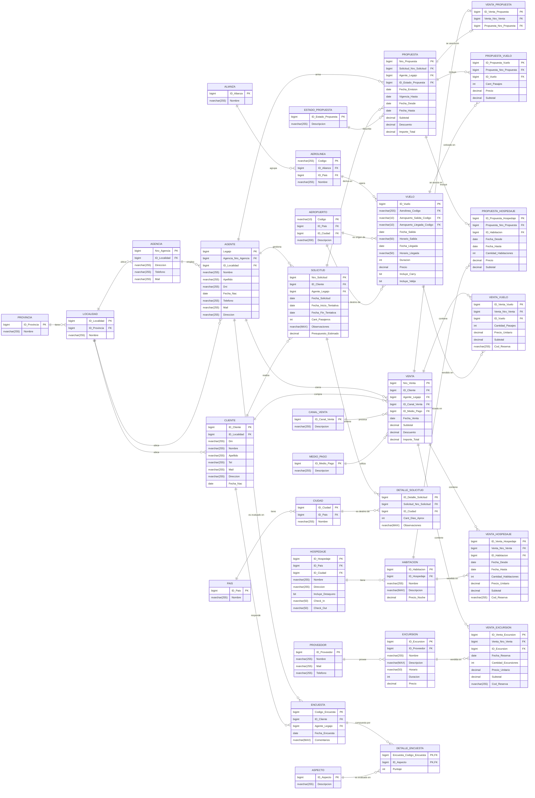

```mermaid
erDiagram
direction LR

    AGENCIA {
        bigint Nro_Agencia PK
        bigint ID_Localidad FK
        nvarchar(255) Direccion
        nvarchar(255) Telefono
        nvarchar(255) Mail
    }

    AGENTE {
        bigint Legajo PK
        bigint Agencia_Nro_Agencia FK
        bigint ID_Localidad FK
        nvarchar(255) Nombre
        nvarchar(255) Apellido
        nvarchar(255) Dni
        date Fecha_Nac
        nvarchar(255) Telefono
        nvarchar(255) Mail
        nvarchar(255) Direccion
    }

    CLIENTE {
        bigint ID_Cliente PK
        bigint ID_Localidad FK
        nvarchar(255) Dni
        nvarchar(255) Nombre
        nvarchar(255) Apellido
        nvarchar(255) Tel
        nvarchar(255) Mail
        nvarchar(255) Direccion
        date Fecha_Nac
    }

    PROVINCIA {
        bigint ID_Provincia PK
        nvarchar(255) Nombre
    }

    LOCALIDAD {
        bigint ID_Localidad PK
        bigint ID_Provincia FK
        nvarchar(255) Nombre
    }

    PROVEEDOR {
        bigint ID_Proveedor PK
        nvarchar(255) Nombre
        nvarchar(255) Mail
        nvarchar(255) Telefono
    }

    AEROPUERTO {
        nvarchar(10) Codigo PK
        bigint ID_Pais FK
        bigint ID_Ciudad FK
        nvarchar(200) Descripcion
    }

    AEROLINEA {
        nvarchar(255) Codigo PK
        bigint ID_Alianza FK
        bigint ID_Pais FK
        nvarchar(255) Nombre
    }

    ALIANZA {
        bigint ID_Alianza PK
        nvarchar(255) Nombre
    }

    HOSPEDAJE {
        bigint ID_Hospedaje PK
        bigint ID_Pais FK
        bigint ID_Ciudad FK
        nvarchar(255) Nombre
        nvarchar(255) Direccion
        bit Incluye_Desayuno
        nvarchar(50) Check_In
        nvarchar(50) Check_Out
    }

    PAIS {
        bigint ID_Pais PK
        nvarchar(255) Nombre
    }

    CIUDAD {
        bigint ID_Ciudad PK
        bigint ID_Pais FK
        nvarchar(255) Nombre
    }

    VUELO {
        bigint ID_Vuelo PK
        nvarchar(255) Aerolinea_Codigo FK
        nvarchar(10) Aeropuerto_Salida_Codigo FK
        nvarchar(10) Aeropuerto_Llegada_Codigo FK
        date Fecha_Salida
        nvarchar(50) Horario_Salida
        date Fecha_Llegada
        nvarchar(50) Horario_Llegada
        int Duracion
        decimal Precio
        bit Incluye_Carry
        bit Incluye_Valija
    }

    HABITACION {
        bigint ID_Habitacion PK
        bigint ID_Hospedaje FK
        nvarchar(255) Nombre
        nvarchar(MAX) Descripcion
        decimal Precio_Noche
    }

    EXCURSION {
        bigint ID_Excursion PK
        bigint ID_Proveedor FK
        nvarchar(255) Nombre
        nvarchar(MAX) Descripcion
        nvarchar(50) Horario
        int Duracion
        decimal Precio
    }

    SOLICITUD {
        bigint Nro_Solicitud PK
        bigint ID_Cliente FK
        bigint Agente_Legajo FK
        date Fecha_Solicitud
        date Fecha_Inicio_Tentativa
        date Fecha_Fin_Tentativa
        int Cant_Pasajeros
        nvarchar(MAX) Observaciones
        decimal Presupuesto_Estimado
    }

    DETALLE_SOLICITUD {
        bigint ID_Detalle_Solicitud PK
        bigint Solicitud_Nro_Solicitud FK
        bigint ID_Ciudad FK
        int Cant_Dias_Aprox
        nvarchar(MAX) Observaciones
    }

    PROPUESTA {
        bigint Nro_Propuesta PK
        bigint Solicitud_Nro_Solicitud FK
        bigint Agente_Legajo FK
        bigint ID_Estado_Propuesta FK
        date Fecha_Emision
        date Vigencia_Hasta
        date Fecha_Desde
        date Fecha_Hasta
        decimal Subtotal
        decimal Descuento
        decimal Importe_Total
    }

    ESTADO_PROPUESTA {
        bigint ID_Estado_Propuesta PK
        nvarchar(255) Descripcion
    }

    PROPUESTA_VUELO {
        bigint ID_Propuesta_Vuelo PK
        bigint Propuesta_Nro_Propuesta FK
        bigint ID_Vuelo FK
        int Cant_Pasajes
        decimal Precio
        decimal Subtotal
    }

    PROPUESTA_HOSPEDAJE {
        bigint ID_Propuesta_Hospedaje PK
        bigint Propuesta_Nro_Propuesta FK
        bigint ID_Habitacion FK
        date Fecha_Desde
        date Fecha_Hasta
        int Cantidad_Habitaciones
        decimal Precio
        decimal Subtotal
    }

    VENTA {
        bigint Nro_Venta PK
        bigint ID_Cliente FK
        bigint Agente_Legajo FK
        bigint ID_Canal_Venta FK
        bigint ID_Medio_Pago FK
        date Fecha_Venta
        decimal Subtotal
        decimal Descuento
        decimal Importe_Total
    }

    CANAL_VENTA {
        bigint ID_Canal_Venta PK
        nvarchar(255) Descripcion
    }

    MEDIO_PAGO {
        bigint ID_Medio_Pago PK
        nvarchar(255) Descripcion
    }

    VENTA_PROPUESTA {
        bigint ID_Venta_Propuesta PK
        bigint Venta_Nro_Venta FK
        bigint Propuesta_Nro_Propuesta FK
    }

    VENTA_VUELO {
        bigint ID_Venta_Vuelo PK
        bigint Venta_Nro_Venta FK
        bigint ID_Vuelo FK
        int Cantidad_Pasajes
        decimal Precio_Unitario
        decimal Subtotal
        nvarchar(255) Cod_Reserva
    }

    VENTA_HOSPEDAJE {
        bigint ID_Venta_Hospedaje PK
        bigint Venta_Nro_Venta FK
        bigint ID_Habitacion FK
        date Fecha_Desde
        date Fecha_Hasta
        int Cantidad_Habitaciones
        decimal Precio_Unitario
        decimal Subtotal
        nvarchar(255) Cod_Reserva
    }

    VENTA_EXCURSION {
        bigint ID_Venta_Excursion PK
        bigint Venta_Nro_Venta FK
        bigint ID_Excursion FK
        date Fecha_Reserva
        int Cantidad_Excursiones
        decimal Precio_Unitario
        decimal Subtotal
        nvarchar(255) Cod_Reserva
    }

    ASPECTO {
        bigint ID_Aspecto PK
        nvarchar(255) Descripcion
    }

    ENCUESTA {
        bigint Codigo_Encuesta PK
        bigint ID_Cliente FK
        bigint Agente_Legajo FK
        date Fecha_Encuesta
        nvarchar(MAX) Comentarios
    }

    DETALLE_ENCUESTA {
        bigint Encuesta_Codigo_Encuesta PK, FK
        bigint ID_Aspecto PK, FK
        int Puntaje
    }

    AGENCIA ||--o{ AGENTE : "emplea"
    AGENTE ||--o{ SOLICITUD : "gestiona"
    AGENTE ||--o{ PROPUESTA : "arma"
    AGENTE ||--o{ VENTA : "cierra"
    AGENTE ||--o{ ENCUESTA : "es evaluado en"
    CLIENTE ||--o{ SOLICITUD : "realiza"
    CLIENTE ||--o{ VENTA : "compra"
    CLIENTE ||--o{ ENCUESTA : "responde"
    PROVEEDOR ||--o{ EXCURSION : "provee"
    AEROLINEA ||--o{ VUELO : "opera"
    AEROPUERTO ||--o{ VUELO : "es origen de"
    AEROPUERTO ||--o{ VUELO : "es destino de"
    HOSPEDAJE ||--o{ HABITACION : "tiene"
    SOLICITUD ||--o{ DETALLE_SOLICITUD : "contiene"
    SOLICITUD ||--o{ PROPUESTA : "deriva en"
    ENCUESTA ||--o{ DETALLE_ENCUESTA : "compuesta por"
    ASPECTO ||--o{ DETALLE_ENCUESTA : "es evaluado en"
    ALIANZA ||--o{ AEROLINEA : "agrupa"
    VENTA ||--o| VENTA_PROPUESTA : "se asocia en"
    PROPUESTA ||--o| VENTA_PROPUESTA : "se asocia en"
    
    %% Relaciones de Propuesta
    PROPUESTA ||--o{ PROPUESTA_VUELO : "incluye"
    PROPUESTA ||--o{ PROPUESTA_HOSPEDAJE : "incluye"
    VUELO ||--o{ PROPUESTA_VUELO : "cotizado en"
    HABITACION ||--o{ PROPUESTA_HOSPEDAJE : "cotizada en"
    ESTADO_PROPUESTA ||--o{ PROPUESTA : "describe"
    
    %% Relaciones de Venta
    VENTA ||--o{ VENTA_VUELO : "contiene"
    VENTA ||--o{ VENTA_HOSPEDAJE : "contiene"
    VENTA ||--o{ VENTA_EXCURSION : "contiene"
    VUELO ||--o{ VENTA_VUELO : "vendido en"
    HABITACION ||--o{ VENTA_HOSPEDAJE : "vendida en"
    EXCURSION ||--o{ VENTA_EXCURSION : "vendida en"

    PROVINCIA ||--o{ LOCALIDAD : "tiene"
    PAIS ||--o{ CIUDAD : "tiene"
    LOCALIDAD ||--o{ AGENCIA : "ubica"
    LOCALIDAD ||--o{ AGENTE : "ubica"
    LOCALIDAD ||--o{ CLIENTE : "ubica"
    CIUDAD ||--o{ DETALLE_SOLICITUD : "es destino de"
    CANAL_VENTA ||--o{ VENTA : "procesa"
    MEDIO_PAGO ||--o{ VENTA : "utiliza"
```