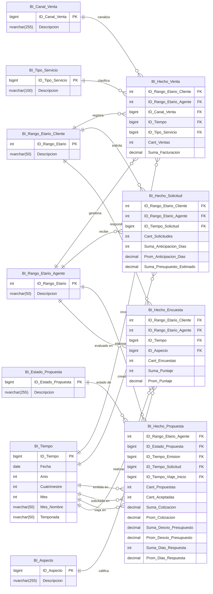

```mermaid
erDiagram
direction LR

    BI_Tiempo {
        bigint ID_Tiempo PK
        date Fecha
        int Anio
        int Cuatrimestre
        int Mes
        nvarchar(50) Mes_Nombre
        nvarchar(50) Temporada
    }

    BI_Rango_Etario_Cliente {
        int ID_Rango_Etario PK
        nvarchar(50) Descripcion
    }

    BI_Rango_Etario_Agente {
        int ID_Rango_Etario PK
        nvarchar(50) Descripcion
    }

    BI_Tipo_Servicio {
        bigint ID_Tipo_Servicio PK
        nvarchar(100) Descripcion
    }

    BI_Canal_Venta {
        bigint ID_Canal_Venta PK
        nvarchar(255) Descripcion
    }

    BI_Estado_Propuesta {
        bigint ID_Estado_Propuesta PK
        nvarchar(255) Descripcion
    }

    BI_Aspecto {
        bigint ID_Aspecto PK
        nvarchar(255) Descripcion
    }

    BI_Hecho_Venta {
        int ID_Rango_Etario_Cliente FK
        int ID_Rango_Etario_Agente FK
        bigint ID_Canal_Venta FK
        bigint ID_Tiempo FK
        bigint ID_Tipo_Servicio FK
        int Cant_Ventas
        decimal Suma_Facturacion
    }

    BI_Hecho_Solicitud {
        int ID_Rango_Etario_Cliente FK
        int ID_Rango_Etario_Agente FK
        bigint ID_Tiempo_Solicitud FK
        int Cant_Solicitudes
        int Suma_Anticipacion_Dias
        decimal Prom_Anticipacion_Dias
        decimal Suma_Presupuesto_Estimado
    }

    BI_Hecho_Propuesta {
        int ID_Rango_Etario_Agente FK
        bigint ID_Estado_Propuesta FK
        bigint ID_Tiempo_Emision FK
        bigint ID_Tiempo_Solicitud FK
        bigint ID_Tiempo_Viaje_Inicio FK
        int Cant_Propuestas
        int Cant_Aceptadas
        decimal Suma_Cotizacion
        decimal Prom_Cotizacion
        decimal Suma_Desvio_Presupuesto
        decimal Prom_Desvio_Presupuesto
        int Suma_Dias_Respuesta
        decimal Prom_Dias_Respuesta
    }

    BI_Hecho_Encuesta {
        int ID_Rango_Etario_Cliente FK
        int ID_Rango_Etario_Agente FK
        bigint ID_Tiempo FK
        bigint ID_Aspecto FK
        int Cant_Encuestas
        int Suma_Puntaje
        decimal Prom_Puntaje
    }

    %% Relaciones de BI_Hecho_Venta (Estrella 1)
    BI_Rango_Etario_Cliente ||--o{ BI_Hecho_Venta : "registra"
    BI_Rango_Etario_Agente ||--o{ BI_Hecho_Venta : "gestiona"
    BI_Canal_Venta ||--o{ BI_Hecho_Venta : "canaliza"
    BI_Tiempo ||--o{ BI_Hecho_Venta : "ocurre en"
    BI_Tipo_Servicio ||--o{ BI_Hecho_Venta : "clasifica"

    %% Relaciones de BI_Hecho_Solicitud (Estrella 2)
    BI_Rango_Etario_Cliente ||--o{ BI_Hecho_Solicitud : "solicita"
    BI_Rango_Etario_Agente ||--o{ BI_Hecho_Solicitud : "recibe"
    BI_Tiempo ||--o{ BI_Hecho_Solicitud : "creada en"

    %% Relaciones de BI_Hecho_Propuesta (Estrella 3)
    BI_Rango_Etario_Agente ||--o{ BI_Hecho_Propuesta : "elabora"
    BI_Estado_Propuesta ||--o{ BI_Hecho_Propuesta : "estado de"
    BI_Tiempo ||--o{ BI_Hecho_Propuesta : "emitida en"
    BI_Tiempo ||--o{ BI_Hecho_Propuesta : "solicitada en"
    BI_Tiempo ||--o{ BI_Hecho_Propuesta : "viaja en"

    %% Relaciones de BI_Hecho_Encuesta (Estrella 4)
    BI_Rango_Etario_Cliente ||--o{ BI_Hecho_Encuesta : "responde"
    BI_Rango_Etario_Agente ||--o{ BI_Hecho_Encuesta : "evaluado en"
    BI_Tiempo ||--o{ BI_Hecho_Encuesta : "realizada en"
    BI_Aspecto ||--o{ BI_Hecho_Encuesta : "califica"
```